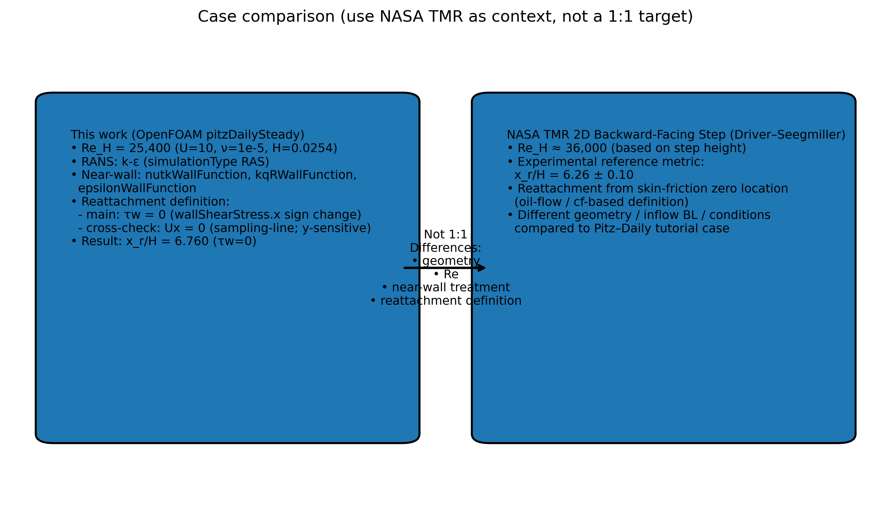
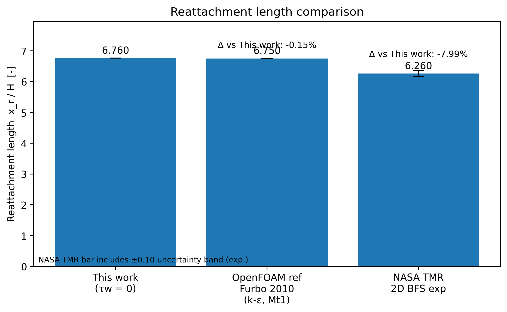
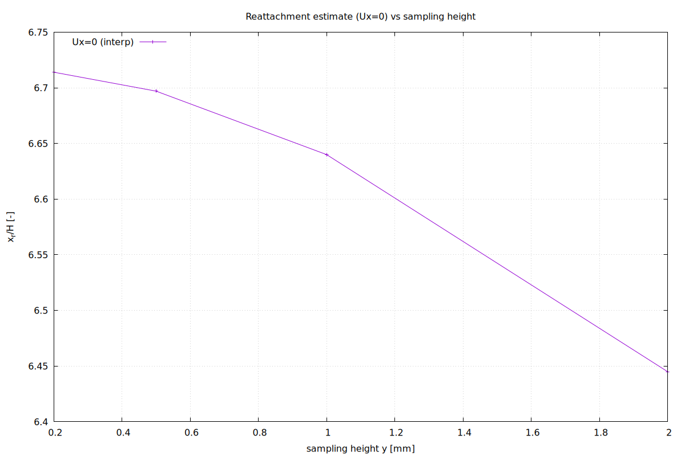
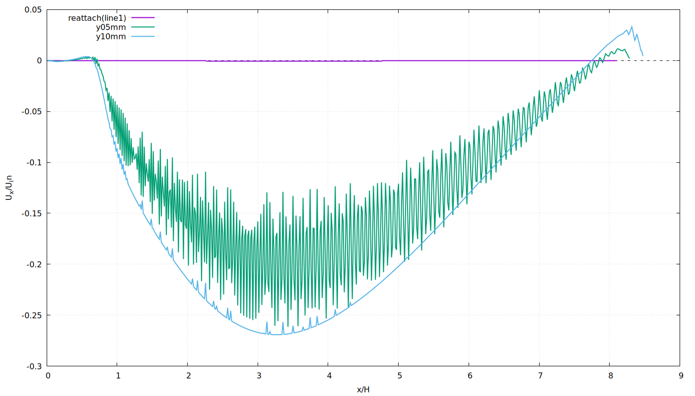

# OpenFOAM BFS Portfolio

## Reattachment-Length Extraction Pipeline and Turbulence-Model Sensitivity on `pitzDailySteady`

이 저장소는 OpenFOAM 공식 tutorial `pitzDailySteady`를 기반으로 2D backward-facing step(BFS) 유동에서 재부착 길이 `xr/H`를 추출하고, 그 추출 절차를 재현 가능하게 만들고, 난류모델(`kEpsilon`, `kOmegaSST`)에 대한 민감도를 비교한 포트폴리오 프로젝트다.

핵심은 단순히 튜토리얼을 "돌렸다"가 아니라, 다음 흐름을 끝까지 완성한 데 있다.

- 관심량(QoI) `xr/H`를 먼저 정의했다.
- 후처리 규칙을 스크립트와 라인 샘플링으로 고정했다.
- `tau_w = 0` 기반 정의와 near-wall `Ux = 0` 기반 추출을 교차 검증했다.
- taper 구간 배제, `y` 오프셋 민감도, 시간 안정성을 따로 확인했다.
- 같은 절차를 `kEpsilon`과 `kOmegaSST`에 그대로 적용해 모델 민감도를 정량화했다.

메인 작업 디렉터리는 [`trackA/`](trackA)다.

## 프로젝트 한 줄 요약

`pitzDailySteady`의 BFS 유동에서 near-wall line sampling과 후처리 파이프라인을 이용해 `xr/H`를 추출했고, `kOmegaSST`가 `kEpsilon`보다 약 16.7~17.2% 더 긴 재부착 길이를 예측함을 확인했다.

## 문제 설정

- 해석 유형: steady-state RANS (`simulationType RAS`)
- 솔버 흐름: `foamRun` / `incompressibleFluid`, SIMPLE
- 유체: Newtonian, `nu = 1e-05 m^2/s`
- 유입 속도: `U_in = 10 m/s`
- 기준 길이: step height `H = 0.0254 m`
- Reynolds 수: `Re_H = U H / nu = 25400`
- baseline: `trackA/00_pitzDailySteady` with `kEpsilon`
- variant: `trackA/11_kOmegaSST` with `kOmegaSST`
- exploratory archive: `trackA/archive/11_realizableKE`

## 무엇을 검증했는가

### 1. QoI 정의

이 프로젝트의 QoI는 무차원 재부착 길이 `xr/H`다.

재부착 위치 `xr`는 lower wall 바로 위에서 추출한 `Ux(x)` 라인 데이터에서 계산했다. 단순히 첫 번째 zero-crossing을 쓰지 않고, `Ux < 0`인 역류 구간들 중에서 가장 긴 구간을 주 재순환 버블(primary recirculation)로 간주하고, 그 구간의 downstream `Ux = 0` 교차점을 선형 보간으로 계산했다.

이 규칙을 택한 이유는 작은 국소 포켓이나 잡음 때문에 잘못된 교차점을 재부착점으로 잡는 것을 피하기 위해서다.

### 2. 정의 기반 교차 검증

재부착의 정식 정의는 wall shear stress의 부호 변화, 즉 `tau_w = 0` 지점이다. 그래서 이 프로젝트에서는 다음 두 기준을 분리해서 다뤘다.

- 메인 QoI: near-wall `Ux = 0` 기반 `xr/H`
- 교차 검증: lower wall `tau_w = 0` 기반 재부착 위치

baseline case에서는 `tau_w = 0` 기반 `xr/H = 6.760`이 나왔고, near-wall `Ux` 기반 `xr/H = 6.776`과 매우 가깝게 맞았다. 따라서 메인 QoI 정의가 물리적으로도 납득 가능하다고 판단했다.

### 3. 강건성 점검

결과를 숫자 하나로 끝내지 않고 다음 세 가지를 별도로 확인했다.

- taper 구간 배제: outlet taper가 시작되는 `x = 0.206 m` 이후를 제외해도 `xr/H`가 동일한지 확인
- `y` 오프셋 민감도: wall-adjacent line, `+0.5 mm`, `+1.0 mm`에서 추출값 비교
- 시간 안정성: SST case에서 `t = 600`과 `t = 685`를 같은 알고리즘으로 비교

## 핵심 결과

### 모델 비교 결과 (`x <= 0.206 m` 제한 적용)

| Sampling line | kEpsilon (`t=285`) | kOmegaSST (`t=685`) | Change |
| --- | ---: | ---: | ---: |
| wall-adjacent (`y=-0.025399`) | 6.7764 | 7.9368 | +17.12% |
| `+0.5 mm` (`y=-0.024899`) | 6.6971 | 7.8498 | +17.21% |
| `+1.0 mm` (`y=-0.024399`) | 6.6401 | 7.7494 | +16.71% |

같은 QoI 정의, 같은 추출 규칙, 같은 geometry cutoff를 유지했을 때 `kOmegaSST`가 `kEpsilon`보다 일관되게 더 긴 재부착 길이를 예측했다.

### 시간 안정성 결과 (SST)

| Sampling line | `t=600` | `t=685` | Change |
| --- | ---: | ---: | ---: |
| wall-adjacent | 7.9423 | 7.9368 | -0.07% |
| `+0.5 mm` | 7.8551 | 7.8498 | -0.07% |
| `+1.0 mm` | 7.7827 | 7.7494 | -0.43% |

즉, 최종 보고값은 종료 직전의 우연한 값이 아니라 plateau에 들어간 안정값으로 볼 수 있다.

### baseline case 추가 체크

- `checkMesh`: `Mesh OK.`
- max non-orthogonality: `5.95045`
- max skewness: `0.260575`
- baseline 수렴: SIMPLE converged in `285` iterations
- SST 수렴: SIMPLE converged in `685` iterations

## 왜 `kOmegaSST`가 더 길게 나왔는가

이 부분은 관측 결과와 모델 특성에 근거한 해석이다.

- `kEpsilon`과 `kOmegaSST`는 Reynolds stress를 닫는 방식과 near-wall 처리 중심 변수가 다르다.
- `kOmegaSST` case에서는 `grad(U) cellLimited Gauss linear 1`이 추가되어 수치 거동도 baseline과 완전히 같지 않다.
- BFS처럼 박리와 불리한 압력구배가 중요한 문제에서는 shear layer와 wall-adjacent eddy viscosity 분포가 달라지면서 재순환 버블 길이가 바뀔 수 있다.
- 이번 케이스에서는 그 차이가 주 재순환 영역의 downstream 연장으로 나타났고, 결과적으로 `xr/H`가 약 17% 증가했다.

중요한 점은 이것이 "SST는 항상 더 길다"는 일반 법칙을 뜻하지는 않는다는 것이다. mesh, wall treatment, solver setting, QoI 정의에 따라 상대 순서는 달라질 수 있다. 이 저장소가 보여주는 것은 특정 tutorial-derived case에서의 정량적 비교 결과다.

## yPlus와 wall treatment 해석

baseline case의 최종 `yPlus` 통계는 다음과 같다.

- `upperWall`: min `2.82`, max `7.24`, avg `6.09`
- `lowerWall`: min `0.339`, max `26.52`, avg `16.08`

이 값은 전 구간이 전형적인 high-Re wall function 범위에 있다고 보기 어렵다. 그래서 이 프로젝트에서는 `yPlus`를 단독 품질 판정 기준으로 사용하지 않고, separation/reattachment 문제에서 `tau_w -> 0`에 따라 `yPlus`가 낮아질 수 있다는 점을 함께 고려했다. 실제로 lower wall `wallShearStress`는 patch 내부에서 부호가 바뀌었고, 이는 separation bubble 존재와 일치한다.

## 대표 그림

### Geometry / case framing



### Main comparison



### y-offset sensitivity



### Near-wall Ux evidence



추가 그림은 `trackA/deliverables/fig/`와 `trackA/deliverables/fig/FIGURE_INDEX.md`에서 확인할 수 있다.

## 저장소 구성

```text
portfolio_openfoam/
└─ trackA/
   ├─ 00_pitzDailySteady/        # baseline case (kEpsilon)
   ├─ 11_kOmegaSST/              # model-variant case (kOmegaSST)
   ├─ archive/
   │  └─ 11_realizableKE/        # exploratory case, main comparison outside
   ├─ day12_package/             # tables, scripts, evidence, report
   ├─ deliverables/              # curated figures and one-page summary
   └─ day13_fig_curation/        # figure inventory / curation notes
```

GitHub 정리 과정에서 `trackA/release/` 같은 중복 패키지 산출물과 Windows `Zone.Identifier` 메타데이터 파일은 제거했다.

## 재현 방법

OpenFOAM v13 + WSL Ubuntu 환경을 기준으로 했다.

### 1. baseline 실행

```bash
cd $FOAM_RUN/portfolio_openfoam/trackA/00_pitzDailySteady
blockMesh | tee log.blockMesh
checkMesh | tee log.checkMesh
foamRun   | tee log.foamRun
```

### 2. near-wall 샘플링과 QoI 추출

```bash
foamPostProcess -solver incompressibleFluid -func graphUniform_reattach -latestTime
awk -f ../day12_package/scripts/xr_longestNeg.awk postProcessing/graphUniform_reattach/285/line.xy
```

### 3. 민감도 체크

```bash
foamPostProcess -solver incompressibleFluid -func graphUniform_reattach_y05mm -latestTime
foamPostProcess -solver incompressibleFluid -func graphUniform_reattach_y10mm -latestTime
```

### 4. SST 비교

```bash
cd $FOAM_RUN/portfolio_openfoam/trackA/11_kOmegaSST
foamRun > log.foamRun 2>&1
T=$(foamListTimes -latestTime)
foamPostProcess -solver incompressibleFluid -func graphUniform_reattach -time $T
```

### 5. packaged outputs 재생성

```bash
cd $FOAM_RUN/portfolio_openfoam/trackA/day12_package
bash reproduce_day12_tables.sh
```

## 이 프로젝트에서 강조한 점

- 튜토리얼 실행 자체보다 QoI 정의와 추출 규칙 고정에 집중했다.
- 숫자 하나를 보고 끝내지 않고 민감도와 시간 안정성을 같이 확인했다.
- 결과를 그림, 로그, 테이블, 스크립트로 다시 추적할 수 있게 남겼다.
- `tau_w` 기반 정의와 `Ux` 기반 추출을 분리해 설명함으로써 해석 논리를 투명하게 만들었다.

## 한계와 다음 단계

- 공식 tutorial-derived mesh를 사용했기 때문에 별도 mesh independence study는 수행하지 않았다.
- 실험값 또는 canonical BFS benchmark와의 직접 정량 비교는 아직 최소 수준이다.
- `archive/11_realizableKE`까지 포함한 3-model 비교, mesh refinement, NASA TMR 위치(`x/H = 1, 4, 6, 10`) 기반 profile comparison을 확장 과제로 둘 수 있다.
