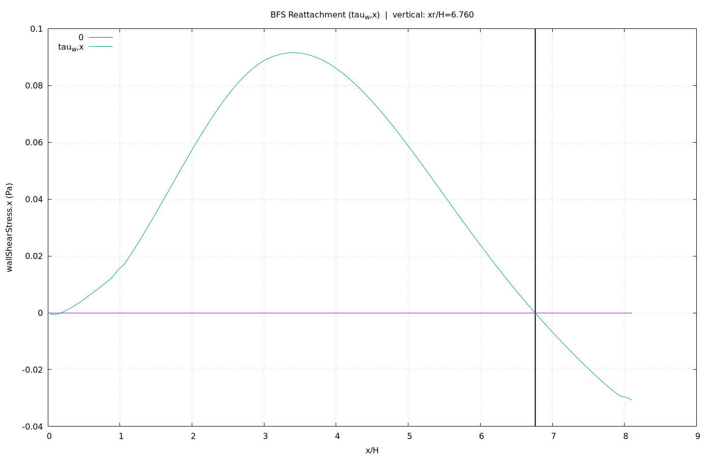
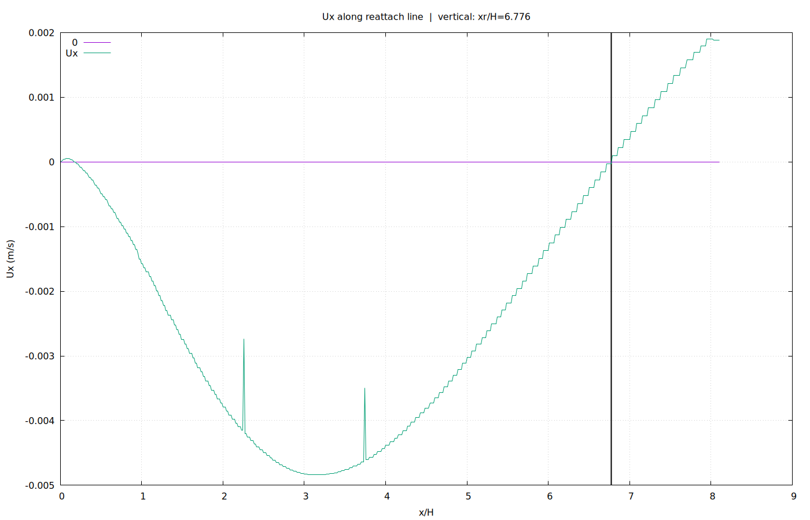
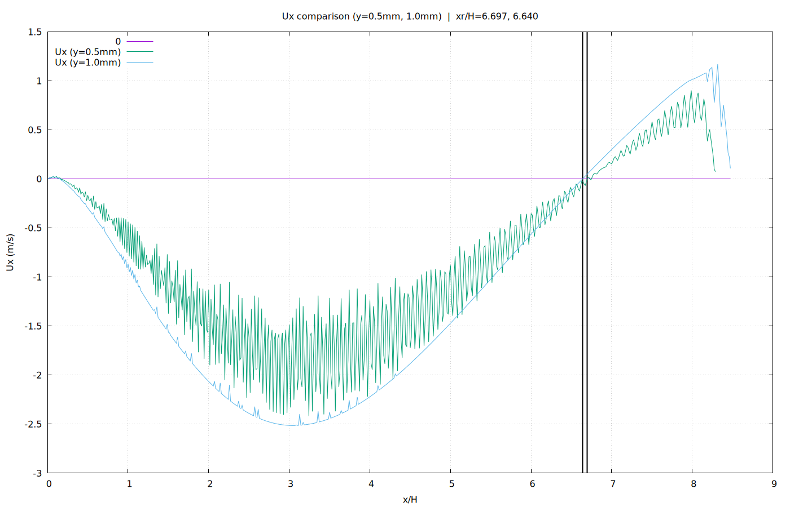

# Day7 — Portfolio Packaging (Reattachment Length)

**Case:** pitzDailySteady (Backward-Facing Step, BFS)  
**Time:** t=285 (latestTime)  
**Reference height:** H=0.0254 m  

## What is measured?
Reattachment length \(x_r\) is reported in non-dimensional form \(x_r/H\).  
Two common definitions were used and cross-validated:

1) **Wall shear criterion:** \( \tau_w = 0 \) (here: wallShearStress.x zero-crossing on lowerWall)  
2) **Velocity criterion:** \( U_x = 0 \) (zero-crossing along sampling lines at different y)

## Key results
See the table: [results.md](./results.md)

## Interpretation (portfolio-ready)
- **\(U_x=0\) 기준은 y(샘플링 높이)에 민감**하다. BFS 재순환 영역/전단층 구조 때문에, y를 조금만 바꿔도 \(U_x\) 부호 전환 위치가 이동한다.  
- 반면 **\(\tau_w=0\) 기준은 벽 전단(패치 정의)에 기반**하므로 “정의(criterion)” 자체가 더 강하게 고정된다.  
- 본 케이스에서 \(x_r/H\)는 **\(\tau_w=0\) 대비 \(U_x=0\)가 약 2% 이내**로 수렴했고, 따라서 **재부착 길이 산출이 교차검증으로 확인되었다.**

## Figures
- Wall shear: 
- Ux (reattach line): 
- Ux (y=0.5mm vs 1.0mm): 
